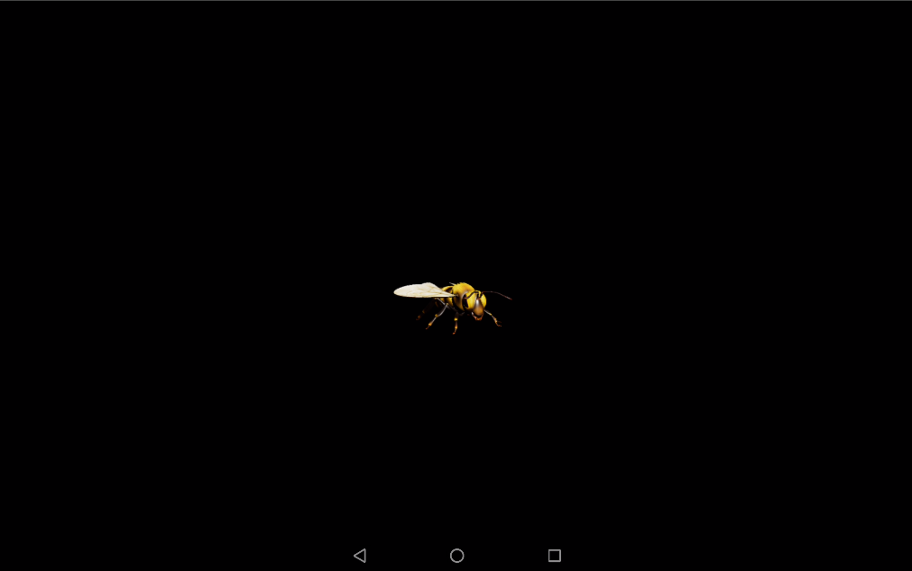
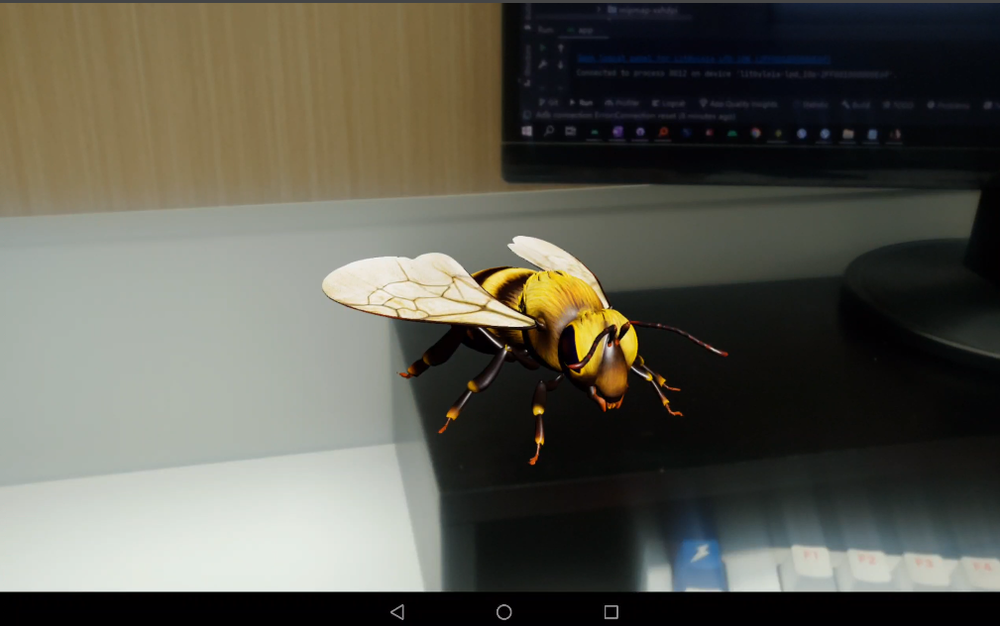
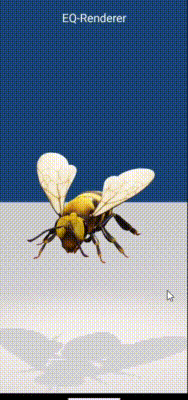
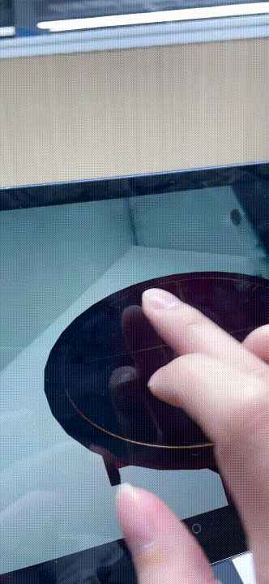
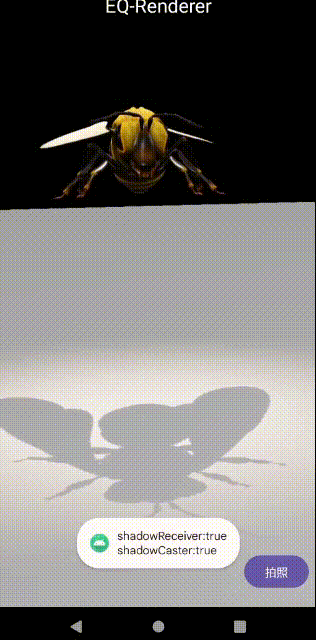
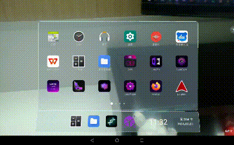
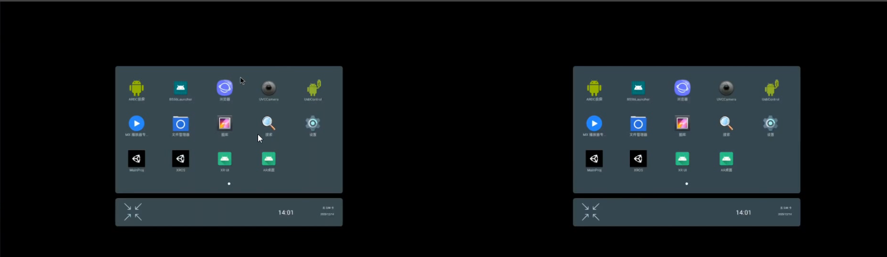
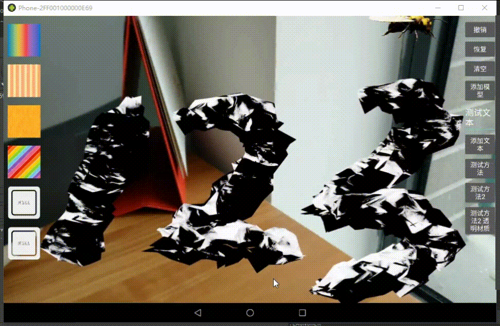
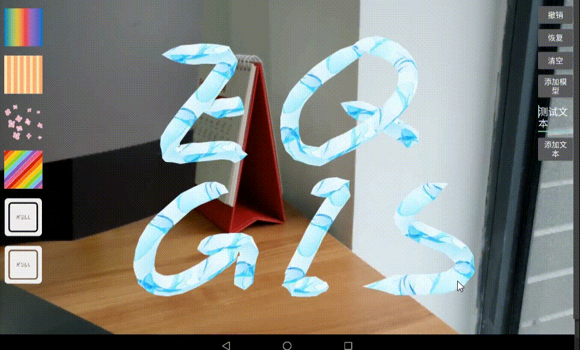

>Sceneform-EQR is an extension for Google's Sceneform Android SDK, designed for applications in graphics, video, augmented reality (AR), and virtual reality (VR). It currently integrates ARCore, AREngine, and ORB-SLAM, and offers multiple scene options—including AR scenes, VR scenes, and custom background scenes—to support a wide range of native 3D development needs.


- Readme.md[中文](./README_CN.md)


# Sceneform - EQR

> The **EQ-Renderer** module is now open-source. It includes integrations with **AREngine**, **ORB-SLAM**, and other extensions based on Google's Sceneform SDK.

---

## Introduction

**Sceneform** is a 3D framework featuring a physically-based renderer optimized for mobile devices. It allows you to easily build augmented reality (AR) applications without directly using OpenGL.

**(Sceneform) EQ-Renderer** is an Android-native 3D renderer built as an extension of Sceneform. It currently supports **ARCore**, **AREngine**, and **ORB-SLAM**, making it a fast and flexible tool for AR development.

---

## Getting Started

### Directory Structure

* `Eq-Renderer`: A rendering library for Android, extended from Sceneform (based on Filament)
* `SampleProj`: Sample application project

```
├─Eq-Renderer
│  └─Android
│      └─eq-renderer
└─SampleProj
    └─app
```

### Run the Sample

1. Open **Android Studio**
2. Go to **File > Open**, select `SampleProj`, and click **OK**
3. Click **Run 'app'** to launch the `app` module

---

## API Documentation

> **sceneform-eqr** is an extension of Sceneform. Its APIs are largely consistent with those of the original Sceneform.

You can refer to the following official documents for more information on Sceneform usage:

> Note:
> Sceneform versions **1.15 and earlier** use `.sfa` and `.sfb` formats for loading models.
> Starting from **version 1.16**, only **GLTF 2.0** models are supported via `gltfio`. See [Filament](https://github.com/google/filament) for details.

* Google Sceneform 1.16: [GitHub source archive](https://github.com/google-ar/sceneform-android-sdk)
* Sceneform 1.15 Docs: [Google Developer Guide (Chinese)](https://developers.google.cn/sceneform/develop/getting-started?hl=zh-cn)

---

## Blog Series

**EQ-Renderer** is an Android-native rendering engine based on Google's Sceneform (Filament). The blog series below walks through how to use it with Android Studio for efficient development.

**CSDN Blog**
[Sceneform-EQR: Android Native 3D Rendering Engine](https://blog.csdn.net/qq_41140324/category_12571725.html)

**CnBlogs**
[Android Native AR Development](https://www.cnblogs.com/eqgis/tag/%E5%AE%89%E5%8D%93%E5%8E%9F%E7%94%9FAR%E5%BC%80%E5%8F%91/)

---

## Feature Preview

* Load **GLTF** models in standard 3D scenes 


* Load **GLTF** models in AR scenes 



* Support for **GLTF model animation**



* Tap gesture interaction



* Gesture-based model manipulation:
  (One-finger rotate, two-finger pan, two-finger zoom)
  



* **Example: AR Launcher**

  > Render native Android Views in AR
  >
  > 

  > Dual-screen display support, useful for XR glasses
  >
  > 

* **Example: AR Graffiti** (Custom textures, animated textures, video textures, displacement mapping)

  > Breathing effect using custom materials compiled with Filament's `matc` tool
  >
  > 

  > Flowing texture using a video as texture map
  >
  > 

---

## Repository

> You don't need to compile the Eq-Renderer source. Just use the **AAR**.

Repository:
[http://repo.eqgis.cn/com/eqgis/eq-renderer](https://repo.eqgis.cn/com/eqgis/eq-renderer)

```groovy
maven {
    allowInsecureProtocol = true
    url "http://repo.eqgis.cn"
}
```

