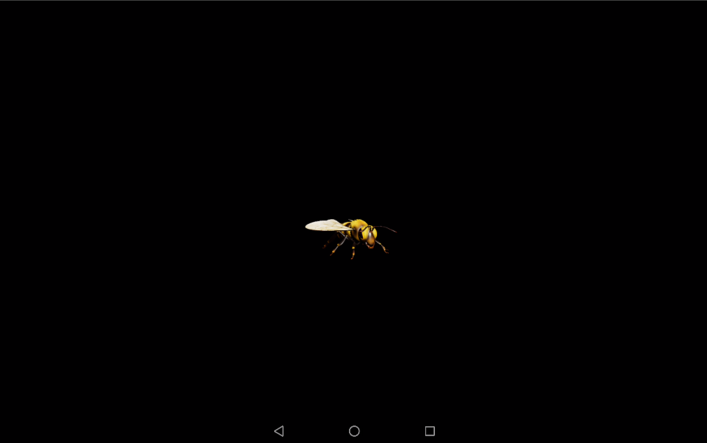
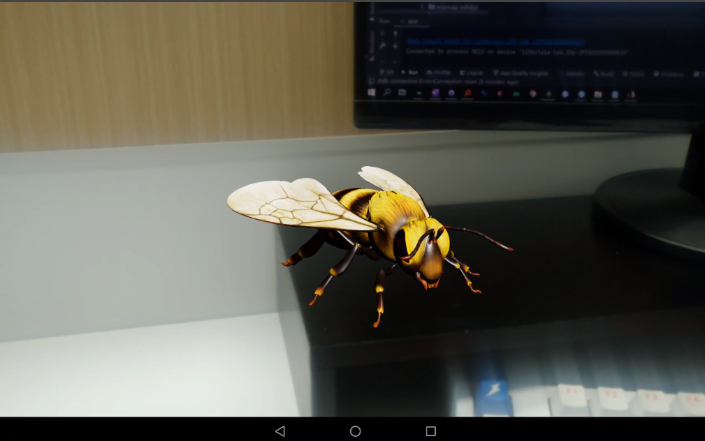
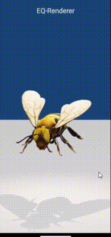
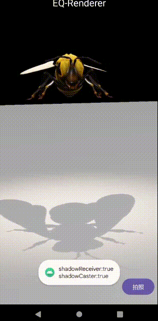

# Sceneform-EQR

[中文文档](./README_CN.md)

Sceneform-EQR is an Android-native 3D/XR rendering library extended from Google Sceneform and powered by Filament. It provides reusable scene layouts, model and geometry rendering, animation, interaction, Android View rendering, video/external textures, ARCore/AREngine integration, VR, PLY point clouds, and 3D Gaussian Splatting support.

The Apache-2.0 `main` branch supports ARCore and AREngine but does not contain the GPL-licensed eq-slam implementation. ORB-SLAM3 integration code and binaries are documented in the [GPLv3 branch](https://github.com/eqgis/Sceneform-EQR/tree/main-GPLv3).

[](https://github.com/eqgis/Sceneform-EQR)
[](https://github.com/google/filament)
[](https://github.com/google-ar/arcore-android-sdk)
[](https://developer.huawei.com/consumer/cn/doc/graphics-References/ar-engine-java-api-0000001064060313)
[](./LICENSE)

Mirrors: [GitHub](https://github.com/eqgis/Sceneform-EQR) · [GitCode](https://gitcode.com/EQXR/Sceneform-EQR)

## Capabilities

| Area | Included capabilities |
| --- | --- |
| Scene containers | Standard 3D `SceneLayout`, AR `ARSceneLayout`, mirrored display `MirrorSceneLayout`, camera-background, extended-background, and VR SceneView variants |
| Models and geometry | GLTF/GLB, PLY point clouds/Mesh,  dynamic Mesh, `Line3D`, and point/line/triangle primitives |
| Materials and lighting | PBR parameters, custom Filament `.filamat`, IBL, skyboxes, shadows, external textures, point-size materials, and screen-space wide-line materials |
| Animation | GLTF model clips, node rotation, translation, path animation, repeat parameters, and access to the model animation source duration |
| Interaction | Node tap/touch, ray hit-test, collision coordinates, Android View picking, node gestures, and camera rotate/pan/zoom gestures |
| Android UI in 3D | `ViewRenderable` support for `TextView`, `ImageView`, `WebView`, common widgets, XML layouts, and scrollable layouts |
| Video and XR | 2D video backgrounds, video-textured Cube/Quad, 360° video, live Camera2 streams, ARCore, Huawei AREngine, AR plane detection, and 3DoF AR/VR fallbacks |
| Utilities | Screen/world coordinate conversion, camera rays, spatial measurement, scene capture/export, async resource caching, and performance diagnostics |

## Repository Layout

```text
.
├─ Eq-Renderer/
│  └─ Android/eq-renderer/   # Android rendering library and native Filament integration
├─ SampleProj/               # Runnable Android sample and tutorial application
├─ Tool/                     # Filament tools, material sources, IBL assets, and build scripts
└─ doc/
   ├─ javadoc/               # Generated API documentation
   └─ img/                   # README screenshots and animations
```

The library code belongs in `Eq-Renderer`, integration examples belong in `SampleProj`, and material/asset compilation inputs belong in `Tool`.

## Requirements

| Item | Current repository setting |
| --- | --- |
| Android | min SDK 24; compile/target SDK 34 |
| Build toolchain | JDK 17, Gradle 8.5, Android Gradle Plugin 8.1.0 |
| Native toolchain | NDK 27.3.x and CMake 3.22.1 when building the library from source |
| Java/Kotlin bytecode | Java 8 / JVM 1.8 target |
| ABI | `arm64-v8a` is enabled by the current library and sample configuration |
| Optional AR services | ARCore 1.45.0 and/or Huawei AREngine 4.0.0.5 |

AR features still depend on the device, camera permission, and the installed AR service. The XR tutorial shows the detected reason and uses Camera2 3DoF where a fallback is possible.

## Getting Started

### Run the sample from source

1. Clone the repository.
2. Open the `SampleProj` directory in Android Studio.
3. Allow Gradle to sync the local `:eq-renderer` module.
4. Connect an `arm64-v8a` Android 7.0+ device and run the `app` configuration.

Command-line build on Windows:

```powershell
cd SampleProj
.\gradlew.bat assembleDebug
```

### Use the published AAR

The current source declares the Maven coordinates `com.eqgis:eq-renderer:1.2.1`. Add the EQGIS repository in `settings.gradle`:

```groovy
dependencyResolutionManagement {
    repositories {
        google()
        mavenCentral()
        maven {
            allowInsecureProtocol = true
            url "http://repo.eqgis.cn"
        }
    }
}
```

Then add the dependency:

```groovy
dependencies {
    implementation "com.eqgis:eq-renderer:1.2.1"

    // Add only the XR runtime used by your application.
    implementation "com.google.ar:core:1.45.0"
    // implementation "com.huawei.hms:arenginesdk:4.0.0.5"
}
```

Repository browser: [repo.eqgis.cn/com/eqgis/eq-renderer](https://repo.eqgis.cn/com/eqgis/eq-renderer)

### Create a basic 3D scene

Add `SceneLayout` to an XML layout:

```xml
<com.eqgis.eqr.layout.SceneLayout
    android:id="@+id/scene_layout"
    android:layout_width="match_parent"
    android:layout_height="match_parent" />
```

Initialize it and forward the host lifecycle:

```java
private SceneLayout sceneLayout;

@Override
protected void onCreate(Bundle savedInstanceState) {
    super.onCreate(savedInstanceState);
    setContentView(R.layout.your_scene);
    sceneLayout = findViewById(R.id.scene_layout);
    sceneLayout.init(this)
            .addIndirectLight("enviroments/light/lightroom_ibl.ktx", 50);
}

@Override
protected void onResume() {
    super.onResume();
    sceneLayout.resume();
}

@Override
protected void onPause() {
    sceneLayout.pause();
    super.onPause();
}

@Override
protected void onDestroy() {
    sceneLayout.destroy();
    super.onDestroy();
}
```

See [`BaseSceneActivity.java`](./SampleProj/app/src/main/java/com/eqgis/test/samples/BaseSceneActivity.java) for model loading, lighting, camera configuration, and node interaction.

### Camera gestures

```java
CameraGestureController cameraController =
        new CameraGestureController(sceneLayout.getCamera())
                .attachTo(sceneLayout.getSceneView());

// Detach before the host view is destroyed.
cameraController.detach();
```

### Create Cube

```java
MaterialFactory.makeOpaqueWithColor(requireContext(), new Color(1.0f, 0.55f, 0.1f))
    .thenAccept(material -> {
        cubeNode = new Node();
        cubeNode.setRenderable(GeometryUtils.makeCube(
            new Vector3(0.8f, 0.8f, 0.8f),
            Vector3.zero(),
            material));
        cubeNode.setWorldPosition(new Vector3(0, 0, -2.8f));
        cubeNode.setParent(sceneLayout.getRootNode());
    });
```

## Tutorial Catalog

The sample app contains one Fragment per lesson and destroys the previous Fragment when switching tabs so scene, model, media, and AR lifecycles can complete correctly.

| Topic | Lessons |
| --- | --- |
| Basic Geometry and Mesh | Five primitive topologies, triangle, plane, Cube, GLTF/GLB, and PLY |
| Android View Rendering in 3D | TextView, ImageView, WebView, common widgets, XML Layout/ScrollView |
| Materials, Lighting, and Camera | PBR parameters, light types, IBL, skybox, FOV, clipping planes, shadows |
| Animation | Overview, GLTF model clips, rotation, translation, and Bézier path animation |
| Interaction | Camera gestures, node gestures, collision coordinates, ViewNode picking, Node hit-test |
| Video, Camera, and External Textures | 2D video background, Cube/Quad video texture, panorama video, Camera2 stream |
| XR | ARCore/AREngine detection, AR plane detection, AR 3DoF, VR 3DoF, ORB-SLAM3 integration guide |
| Advanced Topics | Lifecycle, async/cache, performance, custom Filament material, dynamic Mesh/Line3D, capture/export, ray measurement |

The legacy/common samples also demonstrate standard 3D scenes, PLY/3DGS, interaction, video, AR, VR, 360° VR, textured Earth rendering, and coordinate conversion.

## API and Tooling

- [Generated Javadoc](./doc/javadoc/index.html)
- [Sceneform 1.16 source archive](https://github.com/google-ar/sceneform-android-sdk)
- [Sceneform 1.15 developer guide](https://developers.google.cn/sceneform/develop/getting-started?hl=en)
- [Filament documentation](https://google.github.io/filament/)

Sceneform 1.15 and earlier used `.sfa`/`.sfb`. This repository uses Filament `gltfio` and GLTF 2.0 (`.gltf`/`.glb`) for model loading.

`Tool` contains Windows builds of `matc`, `cmgen`, `gltf_viewer`, and `resgen`, along with the source `.mat` files used by the renderer. Run `Tool/genfilamat-mobile.bat` after editing a bundled material, then update the corresponding Android raw resource.

## Lifecycle Rules

- Forward `resume()`, `pause()`, and `destroy()` to every `SceneLayout`/`ARSceneLayout` host.
- Remove scene-owned nodes and stop animators before releasing renderables or materials.
- In asynchronous model/material callbacks, verify that the Fragment view and scene are still alive before attaching resources.
- For `ExternalTexture`, detach the texture from every material/renderable before releasing the player, surface, or texture.
- Do not destroy engine-wide shared GLTF/material resources during a tab switch. `SceneLayout` and `SceneView` coordinate global cleanup after the last active scene exits.
- Release `MediaPlayer`/Media3 players, camera sessions, gesture controllers, and listeners in the matching host lifecycle.

These rules are demonstrated in the lifecycle, async/cache, and video tutorial Fragments.

## Preview

| GLTF in a 3D scene | GLTF in an AR scene |
| --- | --- |
|  |  |

| Model animation | Gesture interaction |
| --- | --- |
|  |  |

More examples include [Android View rendering](./doc/img/g1.gif), [textured sphere rendering](./doc/img/earth.gif), and [video textures](./doc/img/g6.gif).

## Blog Series

- CSDN: [Sceneform-EQR: Android Native 3D Rendering Engine](https://blog.csdn.net/qq_41140324/category_12571725.html)
- CnBlogs: [Android Native AR Development](https://www.cnblogs.com/eqgis/tag/%E5%AE%89%E5%8D%93%E5%8E%9F%E7%94%9FAR%E5%BC%80%E5%8F%91/)
- Self-hosted archive (no longer updated since January 1, 2025): [eqgis.cn/tags/EQ-R](https://www.eqgis.cn/tags/EQ-R)

## License

The `main` branch is licensed under [Apache License 2.0](./LICENSE) and does not include eq-slam.

ORB-SLAM3 is GPLv3. Any branch that includes, modifies, or directly links eq-slam/ORB-SLAM3 must remain GPLv3. The GPL implementation is isolated in the [main-GPLv3 branch](https://github.com/eqgis/Sceneform-EQR/tree/main-GPLv3); its related AAR and source links are listed in the sample app's ORB-SLAM3 tutorial.

Third-party components and bundled assets may retain their own licenses. Review the corresponding source directories before redistribution.
