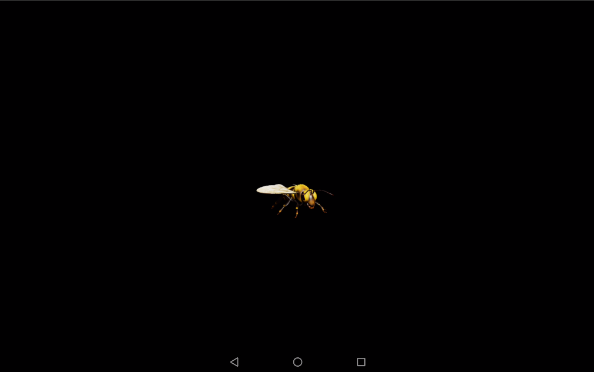
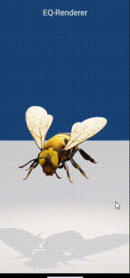
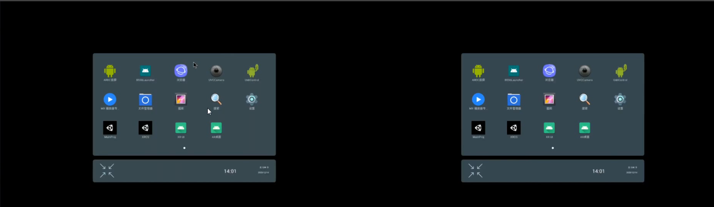

>Sceneform-EQR 是EQ对谷歌“sceneform-android-sdk”的扩展，适用于图形和视频，以及增强现实（AR）和虚拟现实（VR）相关领域。它目前集成了 ARCore、AREngine 和 ORB-SLAM，提供多种场景选项，包括 AR 场景、VR 场景和自定义背景场景，以满足不同的原生三维开发需求。


- [Readme.md(English)](./README.md)

---

# Sceneform - EQR

> EQ-Renderer模块已开源，包含了sceneform中集成AREngine、ORB-SLAM，以及其它对sceneform的扩展。

---

**GitHub**：[eqgis/Sceneform-EQR](https://github.com/eqgis/Sceneform-EQR)   [](https://github.com/eqgis/Sceneform-EQR)

**GitCode**：[EQXR/Sceneform-EQR](https://gitcode.com/EQXR/Sceneform-EQR)   [](https://gitcode.com/EQXR/Sceneform-EQR)

---

[](https://github.com/google/filament)

[](https://github.com/google-ar/arcore-android-sdk)

[](https://developer.huawei.com/consumer/cn/doc/graphics-References/ar-engine-java-api-0000001064060313)

---

## 介绍

Sceneform是一个3D框架，具有基于物理的渲染器，针对移动设备进行了优化，使您可以轻松构建增强现实应用程序，而无需OpenGL。

(Sceneform)EQ-Renderer是基于sceneform扩展的一个用于安卓端的三维AR渲染器。 当前接入了ARCore、AREngine、ORB-SLAM，可快速地进行AR开发。

---


## 运行

### 文件目录

- Eq-Renderer : 基于sceneform（filament）扩展的一个用于安卓端的渲染库
- SampleProj : 示例程序

```
├─Eq-Renderer
│  └─Android
│      └─eq-renderer
└─SampleProj
    └─app
```

### 运行示例

1. 启动AndroidStudio
2.  File > Open，选择`SampleProj`，点击"OK"
3. 点击"Run 'app' "，运行`app`模块

---


## 接口文档
> sceneform-eqr是对sceneform的扩展，相关接口调用与sceneform大同小异。


> sceneform相关接口使用可以参考以下文档。
>
> 需要注意的是：sceneform1.15以及之前的版本采用sfa、sfb的方式加载模型，sceneform1.16仅支持gltf2.0格式的模型（通过gltfio，具体使用可参考[filament](https://github.com/google/filament)）。

Google [sceneform1.16源码存档](https://github.com/google-ar/sceneform-android-sdk)

Google [sceneform1.15帮助文档](https://developers.google.cn/sceneform/develop/getting-started?hl=zh-cn)

---

## 博客专栏

EQ-Renderer是EQ基于sceneform（filament）扩展的一个用于安卓端的渲染引擎。本专栏主要介绍如何在AndroidStudio中使用它快速地进行开发。

**CSDN平台**

[Sceneform-EQR（安卓原生3D渲染引擎）](https://blog.csdn.net/qq_41140324/category_12571725.html)

**博客园**

[安卓原生AR开发](https://www.cnblogs.com/eqgis/tag/%E5%AE%89%E5%8D%93%E5%8E%9F%E7%94%9FAR%E5%BC%80%E5%8F%91/)

**自建站**

>2025年1月1日起，自建站内容不再更新。

[https://www.eqgis.cn/tags/EQ-R](https://www.eqgis.cn/tags/EQ-R)

---


## 功能预览

- 在普通3d场景加载GLTF格式的模型



- 在AR场景加载GLTF格式的模型


- 支持GLTF模型动画




- 渲染一个球体（采用等距圆柱投影的地图作为其纹理）


- 手势点击交互


- 通过手势控制模型（单指旋转、双指平移、双指缩放）


- 案例：AR桌面

> 通过渲染安卓原生View实现


>支持双屏显示，常用于XR眼镜



- 案例：AR涂鸦（自定义纹理、流动纹理、视频纹理、移位贴图）

>呼吸效果，通过Filament的matc工具编译自定义材质文件


>流动纹理，使用视频资源作为纹理贴图


---

## 仓库地址

>不用编译Eq-Renderer源码，直接使用EQ-R的aar

https://repo.eqgis.cn/com/eqgis/eq-renderer

```
maven {
    allowInsecureProtocol = true
    url "http://repo.eqgis.cn"
}
```

---

## 📣 最新活动信息

> 本节记录项目的推广动态、社区活跃度与多平台建设进展。

- ✅ **多平台共建进展**：
  - GitHub：[eqgis/Sceneform-EQR](https://github.com/eqgis/Sceneform-EQR)  
  - GitCode：[EQXR/Sceneform-EQR](https://gitcode.com/EQXR/Sceneform-EQR)  
  
- ✅ **2025-07 更新**：项目已完成 **GitHub ⇌ GitCode** 双向同步，支持国内外用户无障碍访问与协作。

📌 *本模块将持续更新，如你在其他平台发现了该项目的推广信息或媒体报道，欢迎通过 Issue 留言告知，一起建设更完善的生态社区！*